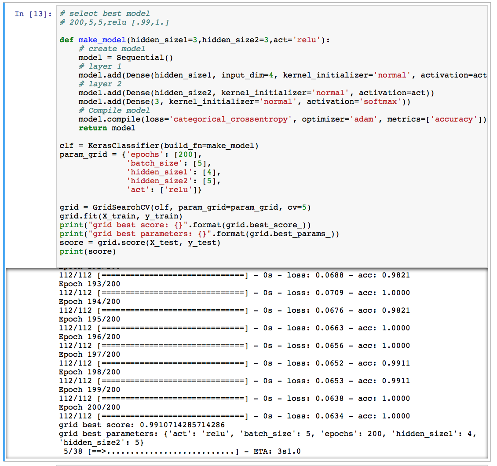
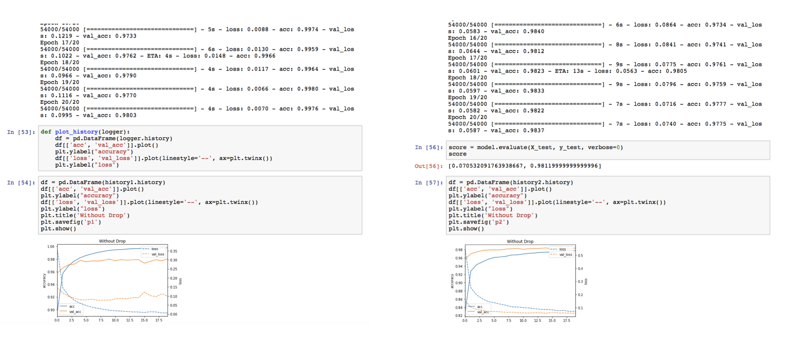
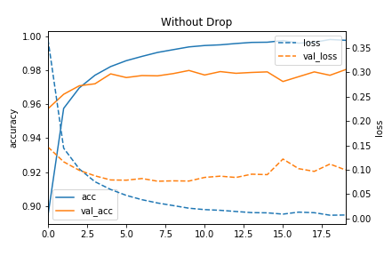
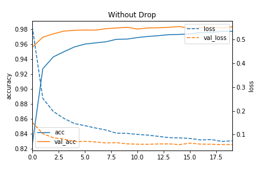
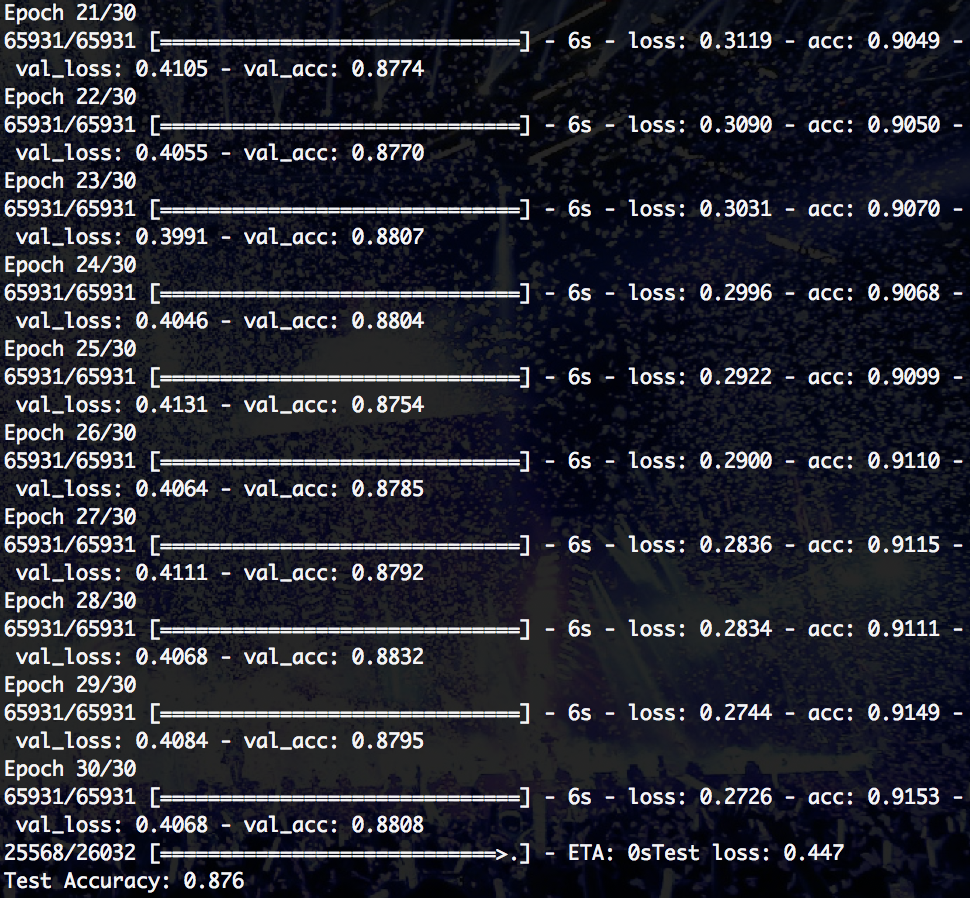
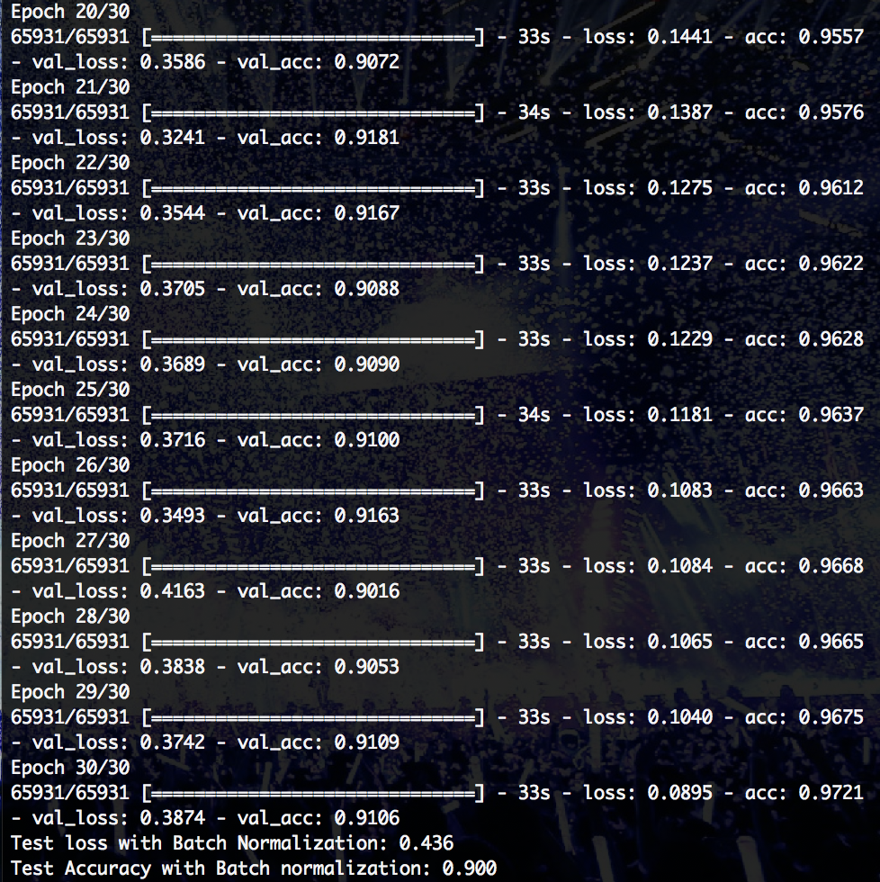
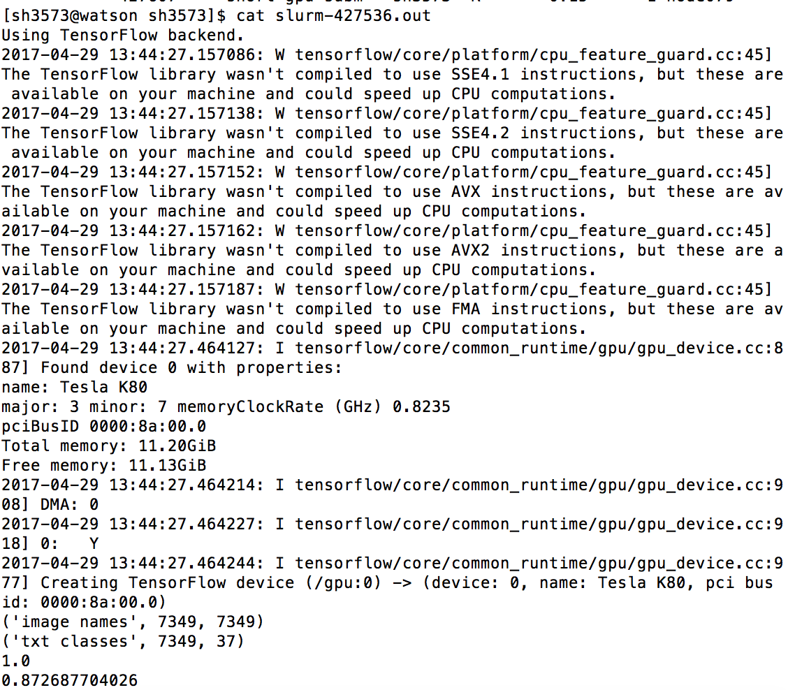

All the tasks are to be completed using the keras Sequential interface. It is a project to practice on Neural Network.

### Task 1

Run a multilayer perceptron (feed forward neural network) with two hidden layers and rectified linear nonlinearities on the iris dataset using the keras Sequential interface. Include code for model selection and evaluation on an independent test-set.

grid best score: 0.9910714285714286

grid best parameters: {'act': 'relu', 'batch_size': 5, 'epochs': 200, 'hidden_size1': 4, 'hidden_size2': 5}

test score: 1.0

### Task 2

Train a multilayer perceptron on the MNIST dataset. Compare a “vanilla” model with a model Qusing drop-out. Visualize the learning curves.

With Dropout(), the model is less likely to overfit.

  

### Task 3

Train a convolutional neural network on the SVHN dataset in format 2 (single digit classification). Achieve at least 85% test-set accuracy with a base model. Also build a model using batch normalization. 

Base Model: 

  - Test Accuracy: 0.876
  
  

Model with Batch Normalization:

  - Test Accuracy with Batch normalization: 0.900
  

### Task 4

Load the weights of a pre-trained convolutional neural network, for example AlexNet or VGG, and use it as feature extraction method to train a linear model or MLP  on the pets dataset. Store the features on disk so you don’t have to recompute them for model selection.

The pets dataset can be found here: http://www.robots.ox.ac.uk/~vgg/data/pets/

best score for train: 1.0

test score: .8727

